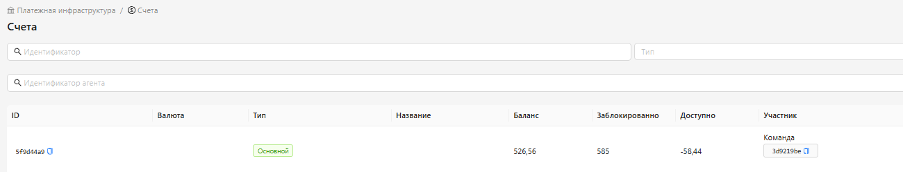

<h1 style="color: black; font-size: 2.2em; font-weight: bold; margin-bottom: 30px;">4.2 Счета</h1>

Отлично! Ты начал изучать «Счета». Продолжай в том же темпе!

  

Счета нужны для подробного отслеживания вашего баланса. В этом разделе вы сможете увидеть: сколько средств доступно, какая сумма заблокирована и общий баланс вашего кабинета. Советуем регулярно проверять этот раздел — так вы всегда будете в курсе состояния ваших финансов.

  

    С разделом «Счета» разобрались! Двигаемся дальше — в следующем разделе вас ждёт «Настройка автоматики». Это важная часть обучения, будьте внимательны!
  

  <a href="#/rules-notes" style="padding: 10px 20px; background-color: #e9ecef; border-radius: 6px; color: black; text-decoration: none; font-weight: bold;">← Назад</a>
  <a href="#/automation" style="padding: 10px 20px; background-color: #e9ecef; border-radius: 6px; color: black; text-decoration: none; font-weight: bold;">Вперёд →</a>

