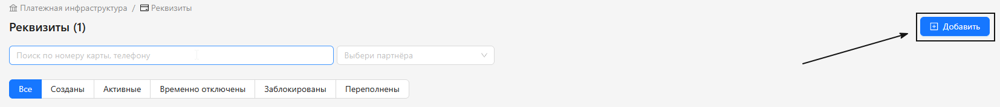
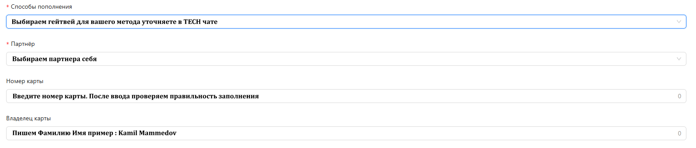
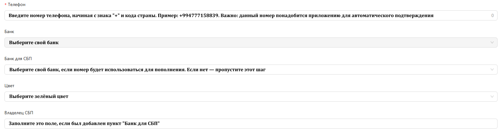
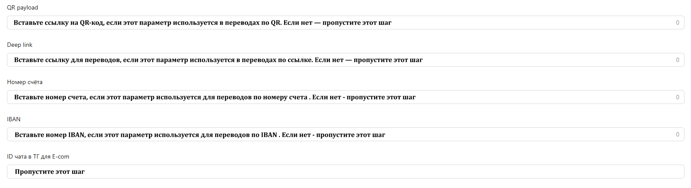
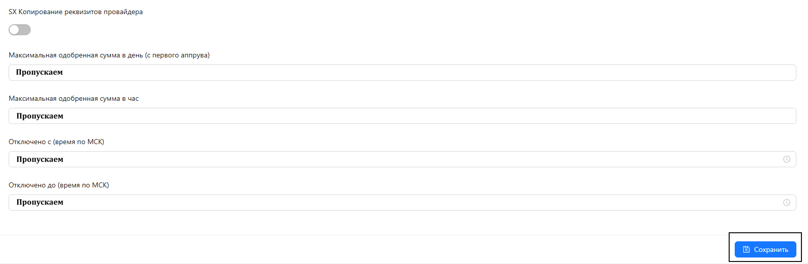

<h1 style="color: black; font-size: 2.2em; font-weight: bold; margin-bottom: 30px;">Добавить реквизит</h1>

  

    
  

  

    
  

  

    
  

  

    
  

  

  

    Отлично! Мы добавили реквизит. Перейди в следующий раздел «Как включить реквизит». Отлично справляешься!
  

  <a href="#/requisites-info" style="padding: 10px 20px; background-color: #e9ecef; border-radius: 6px; color: black; text-decoration: none; font-weight: bold;">← Назад</a>
  <a href="#/activate-requisite" style="padding: 10px 20px; background-color: #e9ecef; border-radius: 6px; color: black; text-decoration: none; font-weight: bold;">Вперёд →</a>

