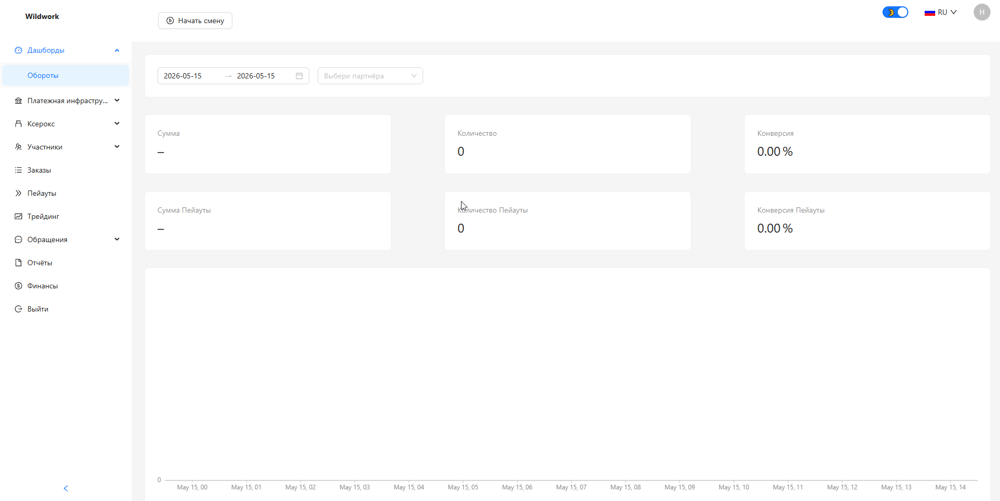

<h1 style="font-weight: bold; color: black; font-size: 3em; margin-bottom: 5px;">
  Welcome to Wild Work
</h1>

Discover new knowledge

  ← Back
  <a href="#/wildworktech" style="padding: 10px 20px; background-color: #e9ecef; border-radius: 6px; color: black; text-decoration: none; font-weight: bold;">Next →</a>

