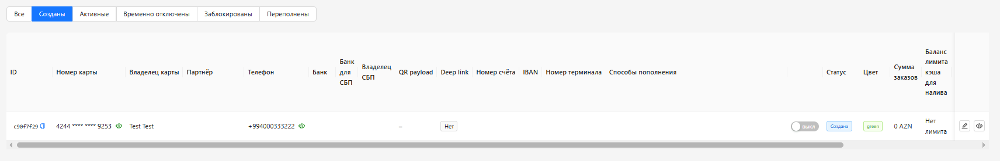
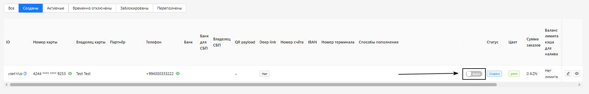
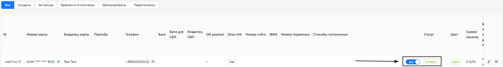

<h1 style="color: black; font-size: 2.2em; font-weight: bold; margin-bottom: 30px;">How to Activate a Requisite</h1>

Great! When we clicked "Save", we were redirected to the "Requisites" tab — "Created" filter.

  

To activate the requisite, you need to toggle the "Activate" switch. If the requisite needs to be deactivated — turn off this toggle.

  

  

  

    Great! We have activated the requisite. Move on to the "Important Rules and Notes" tab.
  

  <a href="#/add-requisite" style="padding: 10px 20px; background-color: #e9ecef; border-radius: 6px; color: black; text-decoration: none; font-weight: bold;">← Back</a>
  <a href="#/rules-notes" style="padding: 10px 20px; background-color: #e9ecef; border-radius: 6px; color: black; text-decoration: none; font-weight: bold;">Next →</a>

