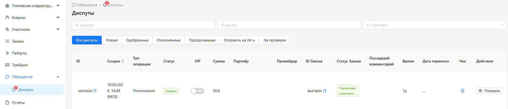
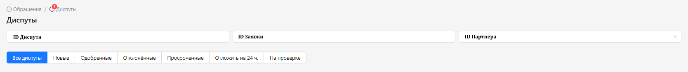
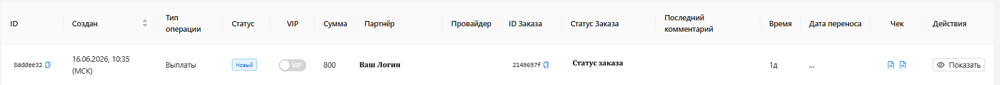
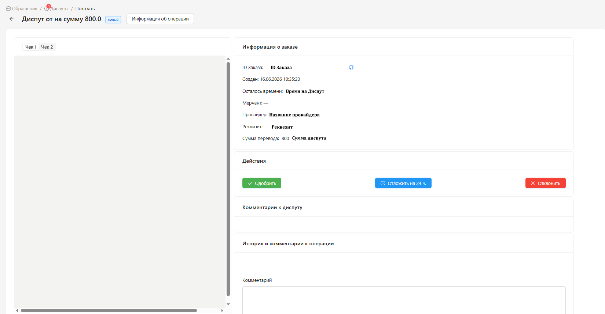

<h1 style="color: black; font-size: 2.2em; font-weight: bold; margin-bottom: 30px;">9. Appeals</h1>

Great! You have moved to the "Appeals" section. This section is intended for handling disputes — disputed situations with requests. This is an important section for your work, study it carefully.

  
  
"Appeals" Section

<h3 style="color: black; font-size: 1.5em; margin-top: 30px;">What is a Dispute</h3>

<strong>A Dispute</strong> is a contested request that has arisen between you and the client. The situation must be resolved in someone's favor. Disputes can come not only to your personal account but also to the <strong>CHECK</strong> chat — such requests are sent by support department employees. Your task when handling a dispute is to check everything as thoroughly as possible and give a well-founded answer.

<h3 style="color: black; font-size: 1.5em; margin-top: 30px;">What Situations Occur</h3>

<strong>1. Dispute about Funds Not Being Credited to the Client</strong>

Reasons:

<ul style="color: black; font-size: 1.15em; padding-left: 20px;">
  <li>No receipt.</li>
  <li>Technical problems on the team's side — due to this, automation did not work.</li>
  <li>The client paid after the request timer expired.</li>
  <li>The client paid the wrong amount, different from the request.</li>
  <li>The client paid in several payments.</li>
  <li>A large amount that requires manual confirmation, but the team did not confirm.</li>
</ul>

<strong>2. Payout Dispute</strong>

Reasons:

<ul style="color: black; font-size: 1.15em; padding-left: 20px;">
  <li>Funds did not reach the client.</li>
  <li>The team mistakenly approved the request.</li>
</ul>

<h3 style="color: black; font-size: 1.5em; margin-top: 30px;">Step-by-Step Guide</h3>

The team is working and sees a dispute notification.

<strong>1. Step:</strong> Go to disputes — we see search bars:

<ul style="color: black; font-size: 1.15em; padding-left: 20px;">
  <li><strong>Dispute ID</strong> — designed to search for a dispute by its unique ID.</li>
  <li><strong>Request ID</strong> — designed to search for a dispute by request ID.</li>
  <li><strong>Partner ID</strong> — designed to search for disputes by partner ID.</li>
</ul>

<strong>2. Step:</strong> We see filter buttons:

<ul style="color: black; font-size: 1.15em; padding-left: 20px;">
  <li><strong>All Disputes</strong> — shows all disputes.</li>
  <li><strong>New</strong> — disputes that have been created and not yet processed.</li>
  <li><strong>Approved</strong> — disputes that you have already confirmed.</li>
  <li><strong>Overdue</strong> — disputes that you did not process in a timely manner.</li>
  <li><strong>Postpone for 24 Hours</strong> — disputes that you postponed for investigation.</li>
  <li><strong>Under Review</strong> — a dispute that you declined and is under review by the support department.</li>
</ul>

  
  
Steps 1-2: Search Bars and Filters

<strong>3.Step:</strong> Click the <strong>"New"</strong> filter and see a new dispute. Click <strong>"Show"</strong> to the right of the dispute.

  
  
Step 3: New Dispute

<strong>4. Step:</strong> We see the dispute itself:

<ul style="color: black; font-size: 1.15em; padding-left: 20px;">
  <li>Information about the order.</li>
  <li>Action buttons: <strong>Approve</strong> — to execute the dispute, <strong>Postpone for 24 Hours</strong> — to investigate the situation, <strong>Decline</strong> — to cancel the dispute.</li>
  <li>History and comments on the operation.</li>
</ul>

  
  
Step 4: Viewing the Dispute

<strong>5. Step:</strong> You need to check all the information and make a decision on the dispute.

<strong>If the dispute is about a top-up:</strong>

<ul style="color: black; font-size: 1.15em; padding-left: 20px;">
  <li>If there is a receipt — <strong>approve</strong>.</li>
  <li>If you need time — <strong>postpone for 24 hours</strong>.</li>
  <li>If there is no receipt — click the <strong>"Decline"</strong> button, then upload video, screenshots, statements to confirm your correctness.</li>
</ul>

<strong>If the dispute is about a payout:</strong>

<ul style="color: black; font-size: 1.15em; padding-left: 20px;">
  <li>If there was no refund — click the <strong>"Decline"</strong> button, upload a video from your personal bank account for that date.</li>
  <li>If you need time — <strong>postpone for 24 hours</strong>.</li>
  <li>If a refund was made — <strong>approve</strong>.</li>
</ul>

<h3 style="color: black; font-size: 1.5em; margin-top: 30px;">⚠️ Important Rules</h3>

<ol style="color: black; font-size: 1.15em; padding-left: 25px;">
  <li><strong>Always check appeals</strong> — even if the section does not show a notification about a new dispute.</li>
  <li><strong>Always check the client's information</strong> as carefully as possible.</li>
  <li><strong>Always check your own information</strong> more carefully than the client's information.</li>
</ol>

  

    Great! We have studied the "Appeals" section. Click "Next" to learn even more new things.
  

  <a href="#/payouts" style="padding: 10px 20px; background-color: #e9ecef; border-radius: 6px; color: black; text-decoration: none; font-weight: bold;">← Back</a>
  <a href="#/reports" style="padding: 10px 20px; background-color: #e9ecef; border-radius: 6px; color: black; text-decoration: none; font-weight: bold;">Next →</a>

