<h1 style="color: black; font-size: 2.2em; font-weight: bold; margin-bottom: 30px;">5. Automation Setup</h1>

Great! We have added the requisite, now we need to set up automation — let's learn how to do it.

<h3 style="color: black; font-size: 1.5em; margin-top: 30px;">Step-by-Step Guide</h3>

  

    
<strong>1. Step:</strong> Download the application file that was sent to you in TECH.CHAT. After downloading, install the application.

  

  

    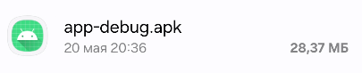
    
Step 1: Download and Install App

  

  

    
<strong>2. Step:</strong> Open the application, enter the reader ID — this is your phone number from the requisite without the "+" sign. Enter the phone number, click "Next".

  

  

    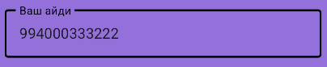
    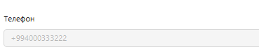
    
Step 2: Enter Reader ID

  

  

    
<strong>3. Step:</strong> After clicking "Next", you need to grant all permissions to the application. After proper configuration, all items should show a checkmark.

  

  

    

      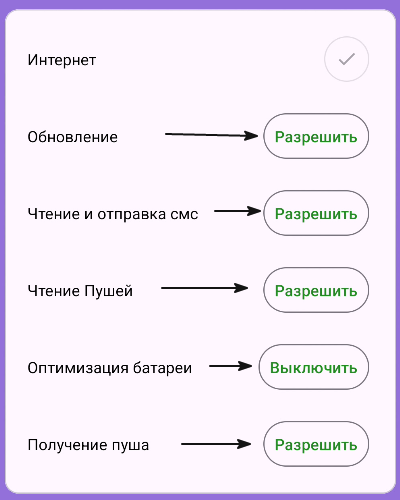
      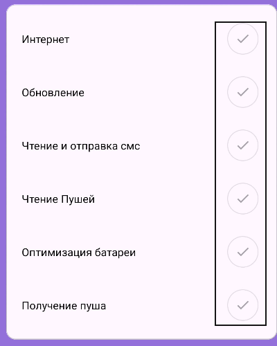
    

    
Step 3: Permissions and Setup

  

  

    
<strong>4. Step:</strong> After granting all permissions, at the bottom there is a section switching bar — you need to click on the "House" to configure the recognition of SMS or push notifications.

  

  

    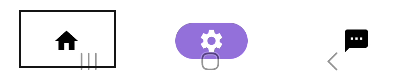
    
Step 4: Go to Notification Section

  

  

    
<strong>5.Step:</strong> You clicked on the "House" — a notification settings menu will open in front of you, which you need to configure.

  

  

    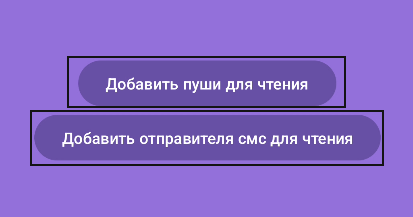
    
Step 5: Notification Settings Menu

  

  

    
<strong>6. Step:</strong> If your notifications come via push — click the "Add Push for Reading" button, find your bank, toggle the switch for your bank, then click the "Save" button.

  

  

    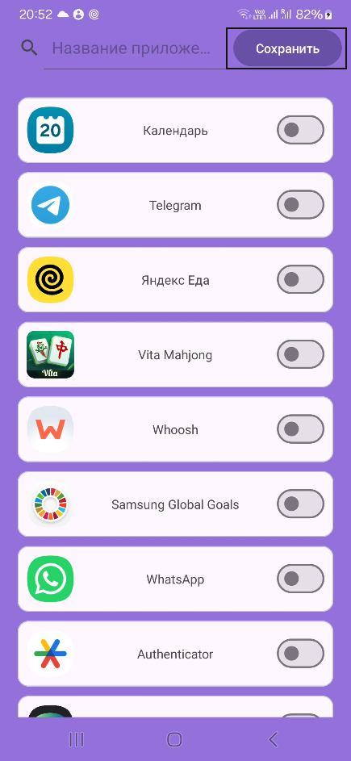
    
Step 6: Add Push for Reading

  

  

    
<strong>7. Step:</strong> If your notifications come via SMS — click "Add SMS Sender for Reading". After clicking "+" to add a sender, specify who sends you messages. For example, if you receive SMS from Birbank — enter Birbank. For example, if you receive SMS about receipts from 00112345 — enter it as is. After entering the SMS sender, click the "Add" button, then be sure to click the "Save" button.

  

  

    

      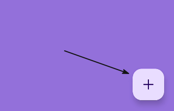
    

    

      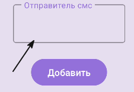
    

    

      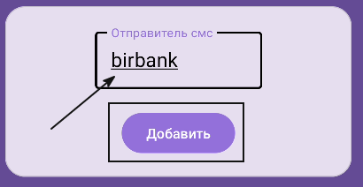
    

    

      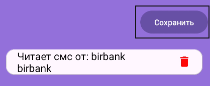
    

    
Step 7: Add SMS Sender

  

  

    
<strong>8. Step:</strong> After adding notifications, you need to activate the application.

  

  

    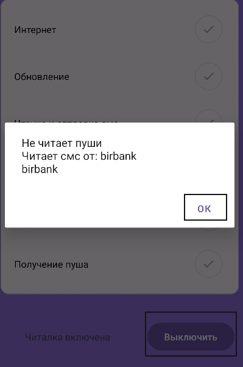
    
Step 8: Activate Application

  

  

    
<strong>9. Step:</strong> After setting up and activating the application, we need to make a test transfer to the requisite you added to verify the correctness of the application setup.Click on the notification in the right corner, make a test transfer — the SMS or push should appear in the application with the PARSED status (if the status is PARSED — this requisite is correctly added and configured, you can put it into operation).

  

  

    

      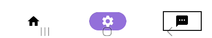
    

    

      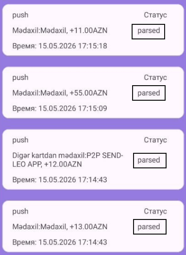
    

    
Step 9: Test Transfer

  

  

    Great! You have set up automation. Now let's move on to the important rules — they will help you avoid mistakes at work.
  

  <a href="#/accounts" style="padding: 10px 20px; background-color: #e9ecef; border-radius: 6px; color: black; text-decoration: none; font-weight: bold;">← Back</a>
  <a href="#/automation-rules" style="padding: 10px 20px; background-color: #e9ecef; border-radius: 6px; color: black; text-decoration: none; font-weight: bold;">Next →</a>

