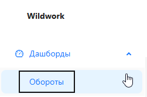
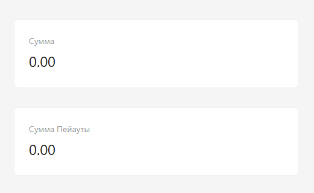
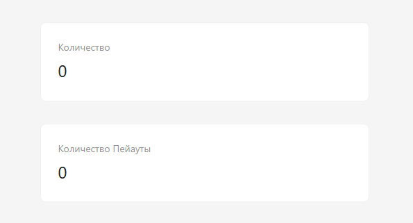
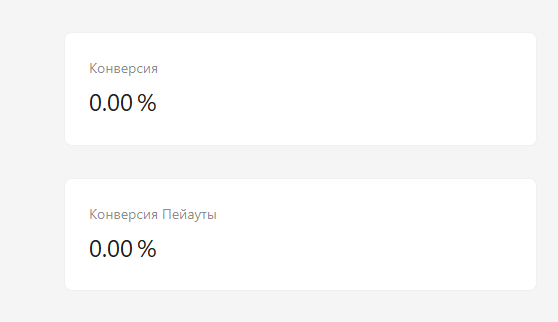

<h1 style="color: black; font-size: 2.2em; font-weight: bold; margin-bottom: 30px;">3. Conversion and Turnover</h1>

  

    
Great! We have smoothly approached the menu — let's explore it! And let's start with the "Dashboard ▶️ Turnover" tab.

    <h3 style="color: black; font-size: 1.5em;">Step-by-Step Guide</h3>
    
<strong>1. Step:</strong> On the left, we have a menu. To view our turnover and conversion, click on the "Dashboards" tab, then click "Turnover".

    
<strong>2. Step:</strong> Great, the panel has opened. In this panel, select the date — from which to which date we want to view information, select a partner — yourself, wait for it to load.

    
<strong>3. Step: Amount / Amount Payouts</strong> These lines show how much you received and how much you paid out.

    
<strong>4. Step: Quantity / Quantity Payouts</strong> These lines show your number of processed requests for receiving and payouts.

    
<strong>5. Step: Conversion / Conversion Payouts</strong> These lines show your conversion percentage for receiving and payouts.

  

  

    
    
Step 1: Menu — Dashboards → Turnover

    
    
Step 3: Amount / Amount Payouts

    

      

        
        
Step 4: Quantity / Quantity Payouts

      

      

        
        
Step 5: Conversion / Conversion Payouts

      

    

  

  

    Great! You have mastered the "Dashboards" section — now analyzing your work will become much easier!
  

  <a href="#/shift-start" style="padding: 10px 20px; background-color: #e9ecef; border-radius: 6px; color: black; text-decoration: none; font-weight: bold;">← Back</a>
  <a href="#/requisites" style="padding: 10px 20px; background-color: #e9ecef; border-radius: 6px; color: black; text-decoration: none; font-weight: bold;">Next →</a>

