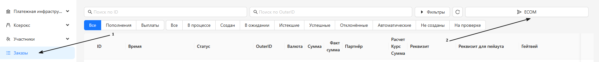
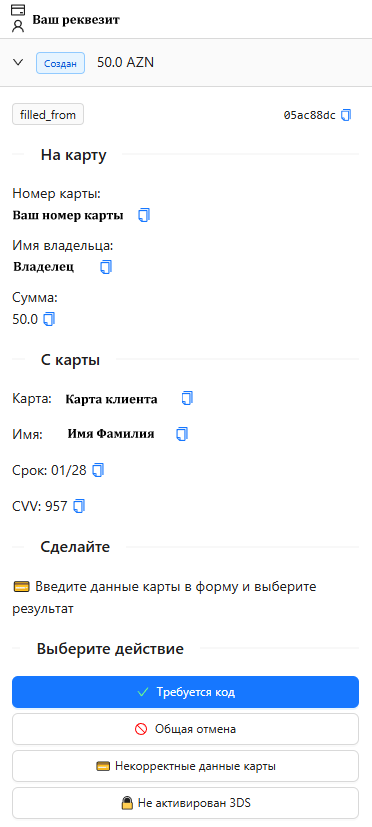
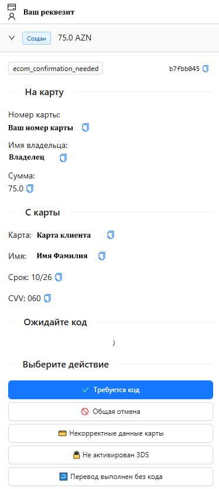

<h1 style="color: black; font-size: 2.2em; font-weight: bold; margin-bottom: 30px;">ECOM</h1>

Great! You have moved to the "ECOM" section. Here we will figure out how to work with orders using the ECOM method.

<h3 style="color: black; font-size: 1.5em; margin-top: 30px;">What is ECOM</h3>

<strong>An ECOM transaction</strong> is an electronic financial transaction that occurs when buying and selling goods or services over the internet. Such transactions are carried out on websites and in mobile applications.

<strong>Features of ECOM payments:</strong>

<ul style="color: black; font-size: 1.15em; padding-left: 20px;">
  <li>involve entering payment data (card number, CVV, expiration date);</li>
  <li>protected by encryption and security protocols;</li>
  <li>confirmed by 3‑D Secure (SMS code, push notification, etc.).</li>
</ul>

<strong>Typical payment methods within ECOM:</strong>

<ul style="color: black; font-size: 1.15em; padding-left: 20px;">
  <li>bank cards (Visa, Mastercard, UnionPay, etc.);</li>
  <li>digital wallets;</li>
  <li>local payment systems and wallets.</li>
</ul>

<h3 style="color: black; font-size: 1.5em; margin-top: 30px;">Step-by-Step ECOM Payment Process</h3>

<ol style="color: black; font-size: 1.15em; padding-left: 25px;">
  <li>The client selects a payment method.</li>
  <li>Enters the card number, CVV, expiration date, and amount.</li>
  <li>Clicks "Pay".</li>
  <li>A payment request comes to you.</li>
  <li>You fill in the data that came to you in your bank.</li>
  <li>Click "Pay" in the bank, and request a confirmation code in the request.</li>
  <li>Wait for the code. When it arrives — enter it in the bank.</li>
  <li>If the payment went through — confirm the request. If the payment did not go through — decline the request.</li>
</ol>

<h3 style="color: black; font-size: 1.5em; margin-top: 30px;">Let's Get to Work</h3>

<h3 style="color: black; font-size: 1.5em; margin-top: 30px;">Step-by-Step Guide</h3>

<strong>1. Step:</strong> To get started, you need to add a requisite. If you forgot how — go back to the <strong>"Add Requisite"</strong> section and refresh your knowledge.

<strong>2. Step:</strong> The requisite has been added — now make it active. If you forgot how — see the <strong>"How to Activate a Requisite"</strong> section.

<strong>3. Step:</strong> The requisite has been added and activated. Next — start the shift and turn on the <strong>"Receiving"</strong> toggle. If you forgot how — go back to the <strong>"Starting a Work Shift"</strong> section.

<strong>4. Step:</strong> After activating the requisite and starting the shift, be sure to make sure the deposit balance on the account is <strong>topped up</strong>.

  
<strong>⚠️ Important Rule:</strong> If the deposit balance is <strong>0</strong> — requests <strong>will not</strong> come to you. The deposit balance must always be positive.

<strong>5. Step:</strong> Everything is activated, everything is checked — go to the <strong>"Orders"</strong> section, click <strong>ECOM</strong> on the right and wait for your first request!

  
<strong>⚠️ Important Rule:</strong> If requests do not come for a long time — contact <strong>TECH-chat</strong> to the administrator.

  
  
"ECOM" Section

  

    
  

  

    <h4 style="color: black; font-size: 1.2em; margin-top: 0;">Your Actions for an Active Request:</h4>
    <ol style="color: black; font-size: 1.15em; padding-left: 25px; text-align: left; margin-top: 5px;">
      <li>Copy the card number from the request.</li>
      <li>Go to the bank, click "Top-up".</li>
      <li>Enter the amount, click "Next".</li>
      <li>Insert the card number, expiration date, and CVV.</li>
      <li>Click "Continue" — the bank will redirect to the code entry form.</li>
      <li>After the form has opened, click "Code Required" in the request.</li>
      <li>Wait for the confirmation code.</li>
      <li>When the code arrives — enter it in the bank form. If the transfer went through successfully — click "Transfer Completed" in the request.</li>
      <li>If the transfer did not go through — click "General Cancellation".</li>
      <li>If the transfer went through without requesting a code — click "Transfer Completed Without Code".</li>
      <li>If the bank gives a card error or the card was entered incorrectly when filling in the data — click "Incorrect Card Data".</li>
      <li>If the bank reports that 3DS is not activated after entering the code — click "3DS Not Activated".</li>
    </ol>
    

      
<strong>⚠️ Important Rules:</strong>

      <ol style="color: black; font-size: 1.05em; padding-left: 20px; text-align: left; margin: 0;">
        <li>Do not request a code until you have reached the bank's code entry form.</li>
        <li>Charge the client exactly the amount specified in the request — no more, no less.</li>
        <li>Do not skip requests with a small amount — each request is processed strictly.</li>
        <li>Do not click "Transfer Completed" until you are sure that the payment has actually gone through. If you confirmed the request and the payment did not go through — the expenses and responsibility are borne by the team.</li>
      </ol>
    

  

  

    
  

  

    In this section, we have covered the <strong>ECOM</strong> method. Let's highlight the main notes on this method:
  

  <ul style="color: black; font-size: 1.1em; padding-left: 20px; margin: 0;">
    <li>To start, you need to <strong>add a requisite</strong>.</li>
    <li>To receive requests, you need to <strong>start the shift for receiving</strong> and maintain a <strong>positive working deposit</strong>.</li>
    <li><strong>Process all requests without exception</strong> — do not skip a single one, regardless of the amount.</li>
<li>Charge the client <strong>the exact amount</strong> as in the request — no more, no less.</li>
    <li><strong>Always check the receipt</strong> before confirming the request.</li>
    <li>To <strong>stop the flow of requests</strong> — turn off the "Receiving" toggle.</li>
  </ul>

  

    Great! We have figured out the ECOM method. Let's move on to the "P2P" section.
  

  <a href="#/filters" style="padding: 10px 20px; background-color: #e9ecef; border-radius: 6px; color: black; text-decoration: none; font-weight: bold;">← Back</a>
  <a href="#/p2p" style="padding: 10px 20px; background-color: #e9ecef; border-radius: 6px; color: black; text-decoration: none; font-weight: bold;">Next →</a>

