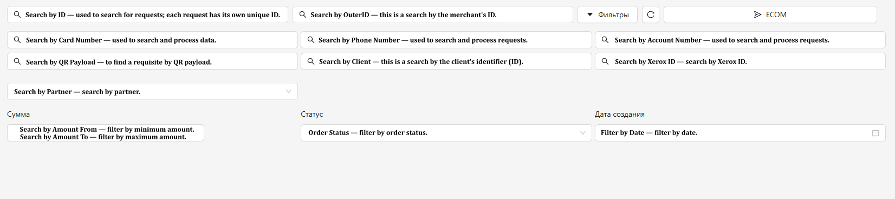

<h1 style="color: black; font-size: 2.2em; font-weight: bold; margin-bottom: 30px;">Filters</h1>

Filtering in the "Orders" section is a very useful function in your arsenal. Let's learn how to use them correctly.

  
  
"Filters" Section

<h3 style="color: black; font-size: 1.5em; margin-top: 30px;">Step-by-Step Guide</h3>

<strong>1. Search by ID</strong> — bar for searching requests by their unique identifier (ID). ID Example: <strong>9dfa78c5-c632-4136-8b5b-6b2f0a6866b0</strong>. This search will come in handy for confirming requests and closing cases from the <strong>"CHECK"</strong> chat.

<strong>2. Search by OuterID</strong> — bar for searching a request by the merchant identifier (OuterID).

<strong>3. Search by Card Number, Phone Number, Account Number</strong> — these fields allow filtering requests by your requisites, collecting statistics on them, and, if necessary, separating tabs by different requisites.

<strong>4. Search by QR payload</strong> — bar for searching a requisite by QR code link. Convenient if you work with QR payments.

<strong>5. Search by Client</strong> — search for requests by client ID. Helps quickly find all transactions of a specific user.

<strong>6. Search by Xerox ID</strong> — bar for searching requests by identifier in the Xerox system.

<strong>7. Search by Partner</strong> — if several partners work in your account, this filter allows separating requests and viewing statistics for each of them separately.

<strong>8. Search by Amount</strong> — allows filtering requests by amount. You can set a range: amount <strong>"FROM"</strong> and amount <strong>"TO"</strong> — and see only those orders that fall within this interval.

<strong>9. Order Status</strong> — gives the ability to display orders with a specific status, for example, only successful or only declined ones.

<strong>10. Creation Date</strong> — a classic period filter: select the start and end date — and you will see all orders for this time period.

<h3 style="color: black; font-size: 1.5em; margin-top: 30px;">Quick Filter Buttons:</h3>

In addition to manual settings, the section has buttons that instantly select orders by key statuses:

<ul style="color: black; font-size: 1.15em; padding-left: 20px;">
  <li><strong>ALL</strong> — a complete list of all requests that came to you.</li>
  <li><strong>IN PROGRESS</strong> — orders that have already been created and are awaiting payment or confirmation.</li>
  <li><strong>SUCCESSFUL</strong> — confirmed requests (automatically or manually).</li>
  <li><strong>DECLINED</strong> — requests that were cancelled after timeout or manually by you or the administrator.</li>
</ul>

  
  
Order Filtering Buttons

    Great! We have understood how to use filters. Let's move on to the actual work by methods — click "Next" to continue.
  

  <a href="#/orders" style="padding: 10px 20px; background-color: #e9ecef; border-radius: 6px; color: black; text-decoration: none; font-weight: bold;">← Back</a>
  <a href="#/ecom" style="padding: 10px 20px; background-color: #e9ecef; border-radius: 6px; color: black; text-decoration: none; font-weight: bold;">Next →</a>

