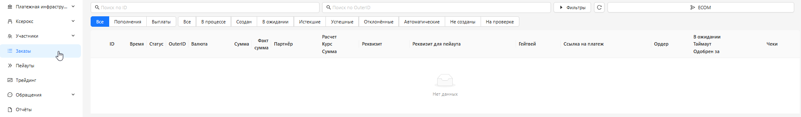

<h1 style="color: black; font-size: 2.2em; font-weight: bold; margin-bottom: 30px;">7. Orders</h1>

Great! We have moved to the "Orders" section. This is a very important section that will be divided into subsections: <strong>Filters</strong>, <strong>ECOM</strong>, <strong>P2P</strong>.

  
  
"Orders" Section

  

    Click the "Next" button and go to the "Filters" section.
  

  <a href="#/participants" style="padding: 10px 20px; background-color: #e9ecef; border-radius: 6px; color: black; text-decoration: none; font-weight: bold;">← Back</a>
  <a href="#/filters" style="padding: 10px 20px; background-color: #e9ecef; border-radius: 6px; color: black; text-decoration: none; font-weight: bold;">Next →</a>

