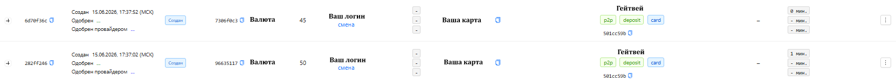
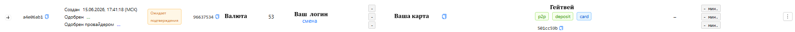
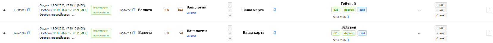
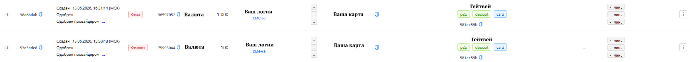

<h1 style="color: black; font-size: 2.2em; font-weight: bold; margin-bottom: 30px;">P2P</h1>

Great! You have moved to the "P2P" section. Here we will figure out how to work with orders using the P2P method.

<h3 style="color: black; font-size: 1.5em; margin-top: 30px;">What is P2P</h3>

<strong>P2P</strong> (peer-to-peer) is a method of transferring money directly from one individual to another through specialized services or banking applications.

<h3 style="color: black; font-size: 1.5em; margin-top: 25px;">How a P2P Transfer Works</h3>

To send money to a recipient, it is enough to specify their identifier — phone number, card number, account number, or IBAN. The service debits funds from the sender's card and credits them to the recipient's card (account). Money arrives quickly — from a few seconds to several minutes.

<h3 style="color: black; font-size: 1.5em; margin-top: 25px;">Key Features</h3>

<ul style="color: black; font-size: 1.15em; padding-left: 20px;">
  <li>Transfer parties — only individuals (private transfers).</li>
  <li>Participants can have cards from different banks — the service ensures interaction between payment systems.</li>
  <li>Minimum details for transfer: usually the recipient's phone number or card number is sufficient.</li>
  <li>Availability 24/7 — transfers can be made at any time via the internet or mobile application.</li>
  <li>Commission — depends on the service and amount (may be zero for transfers within the same bank).</li>
  <li>Amount limits — banks and services set limits for single transfers and for periods (day, month).</li>
</ul>

<h3 style="color: black; font-size: 1.5em; margin-top: 30px;">Step-by-Step P2P Payment Process</h3>

<ol style="color: black; font-size: 1.15em; padding-left: 25px;">
  <li>The client opens the payment form. This form displays your requisite (phone number, card, account, IBAN), your bank name, and the amount to be paid.</li>
  <li>When the client opens the form, a request with the status <strong>"In Progress"</strong> is created in your personal account.</li>
  <li>The client copies your card, inserts it into their banking application, enters the amount, and makes the transfer. Then returns to the form and clicks <strong>"I Paid"</strong>.</li>
  <li>After the money arrives, you receive an SMS or push notification. The automatic confirmation app reads this notification and confirms the request on its own.</li>
  <li>After the request is confirmed, the currency is credited to the client.</li>
</ol>

<h3 style="color: black; font-size: 1.5em; margin-top: 30px;">Let's Get to Work</h3>

<h3 style="color: black; font-size: 1.5em; margin-top: 30px;">Step-by-Step Guide</h3>

<strong>1. Step:</strong> To get started, you need to add a requisite. If you forgot how — go back to the <strong>"Add Requisite"</strong> section and refresh your knowledge.

<strong>2. Step:</strong> The requisite has been added — now make it active. If you forgot how — see the <strong>"How to Activate a Requisite"</strong> section.

<strong>3. Step:</strong> The requisite has been added and activated. Now launch the application for automatic order confirmation, make a test transfer, and check the SMS status in the app. If you forgot how — go to the <strong>"Automation Setup"</strong> section and refresh your knowledge.

<strong>4. Step:</strong> After checking the app and making sure everything works — start the shift, make the "Receiving" toggle active.

<strong>⚠️ Important Rule:</strong> Without checking the application, we <strong>do not activate</strong> the requisite for the P2P direction.

<strong>5. Step:</strong> Check the deposit balance — it must be positive.

  
<strong>⚠️ Important Rule:</strong> If the deposit balance is negative or equals <strong>0</strong> — requests <strong>will not</strong> come to you.

<strong>6. Step:</strong> Everything is activated, everything is checked — go to the <strong>"Orders"</strong> section and track top-up orders.

  
<strong>⚠️ Important Rules:</strong>

  <ul style="color: black; font-size: 1.05em; padding-left: 20px; margin: 0;">
    <li>If your SMS or push notifications come with delays — <strong>deactivate</strong> such requisites until recovery.</li>
    <li>If the application does not read SMS or push — <strong>deactivate</strong> this requisite and investigate the cause.</li>
    <li>If the requisite has poor conversion and most requests are not confirmed — contact <strong>TECH-chat</strong> for help from the administrator.</li>
    <li>If new orders do not come to you for a long time — contact <strong>TECH-chat</strong> to the administrator.</li>
  </ul>

<h3 style="color: black; font-size: 1.5em; margin-top: 30px;">Examples of Active Requests</h3>

  
  
  
  

  

    In this section, we have covered the <strong>P2P</strong> method. Let's highlight the main notes on this method:
  

  <ul style="color: black; font-size: 1.1em; padding-left: 20px; margin: 0;">
    <li>To start, you need to <strong>add a requisite</strong>.</li>
    <li>Before activating the requisite, be sure to <strong>check the application</strong> for automatic request confirmation.</li>
    <li>To receive requests, you need to <strong>start the shift</strong> and maintain a <strong>positive deposit balance</strong>.</li>
    <li><strong>Monitor the automation</strong> — this will help notice and fix errors in time before they affect conversion.</li>
    <li>To <strong>stop the flow of requests</strong> for a specific requisite — deactivate it locally. To completely stop receiving — turn off the "Receiving" toggle.</li>
  </ul>

  

    Great! We have figured out the P2P method. Let's move on to the "Payouts" section.
  

  <a href="#/ecom" style="padding: 10px 20px; background-color: #e9ecef; border-radius: 6px; color: black; text-decoration: none; font-weight: bold;">← Back</a>
  <a href="#/payouts" style="padding: 10px 20px; background-color: #e9ecef; border-radius: 6px; color: black; text-decoration: none; font-weight: bold;">Next →</a>

