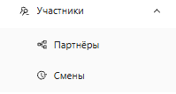
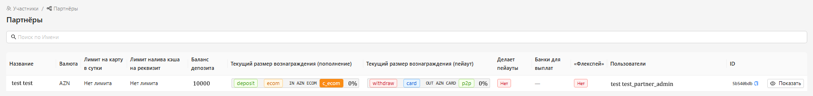
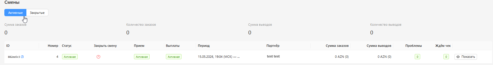
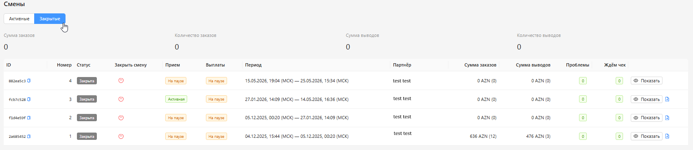

<h1 style="color: black; font-size: 2.2em; font-weight: bold; margin-bottom: 30px;">6. Participants</h1>

  

    
Great! We have moved to the "Participants" section. It will be divided into subsections "Partners" and "Shifts".

  

  

    
    
"Participants" Section

  

<h1 style="color: black; font-size: 2.2em; font-weight: bold; margin-bottom: 30px;">Partners</h1>

By going to the "Partners" section, you will be able to see information on your work agreements:

<ul style="color: black; font-size: 1.15em; padding-left: 20px;">
  <li><strong>Name</strong> — your account name.</li>
  <li><strong>Currency</strong> — the selected currency for your GEO.</li>
  <li><strong>Limits</strong> — set for you when adding the account.</li>
  <li><strong>Deposit Balance</strong> — the size of your current working deposit.</li>
  <li><strong>Reward Amount</strong> — your agreements, your earning percentage.</li>
  <li><strong>User</strong> — your account login, your access level is written in brackets. For example: <strong>test test (partner_admin)</strong>.</li>
</ul>

  
  
"Partners" Section

<h1 style="color: black; font-size: 2.2em; font-weight: bold; margin-bottom: 30px;">Shifts</h1>

By going to the "Shifts" section, you will be able to view your active and closed shifts.

<h3 style="color: black; font-size: 1.5em; margin-top: 25px;">Active Shifts:</h3>

<ul style="color: black; font-size: 1.15em; padding-left: 20px;">
  <li><strong>ID</strong> — your shift ID.</li>
  <li><strong>Number</strong> — active shift number.</li>
  <li><strong>Close Shift</strong> — through this button you can close the shift and start a new one immediately.</li>
  <li><strong>Shift Statuses (Receiving / Payouts)</strong> — shows: paused or active.</li>
  <li><strong>Period</strong> — shows the date and time the shift was started.</li>
  <li><strong>Order Amount</strong> — total amount of successful transactions.</li>
  <li><strong>Withdrawal Amount</strong> — total amount of successful payouts.</li>
</ul>

  
  
Active Shifts

<h3 style="color: black; font-size: 1.5em; margin-top: 25px;">Closed Shifts:</h3>

<ul style="color: black; font-size: 1.15em; padding-left: 20px;">
  <li><strong>ID</strong> — your shift ID.</li>
  <li><strong>Number and Status</strong> — your shift number, the status "Closed" is written to the right of the number.</li>
<li><strong>Shift Statuses (Receiving / Payouts)</strong> — shows what the shift status was at the time of closure.</li>
  <li><strong>Period</strong> — shows from which date to which date the shift was active.</li>
  <li><strong>Order and Withdrawal Amount</strong> — shows how many successful transactions you had for receiving and payouts for the specified period.</li>
</ul>

  
  
Closed Shifts

  

    Great! We have completed another section. Let's move on to the next section "Orders".
  

  <a href="#/automation-rules" style="padding: 10px 20px; background-color: #e9ecef; border-radius: 6px; color: black; text-decoration: none; font-weight: bold;">← Back</a>
  <a href="#/orders" style="padding: 10px 20px; background-color: #e9ecef; border-radius: 6px; color: black; text-decoration: none; font-weight: bold;">Next →</a>

