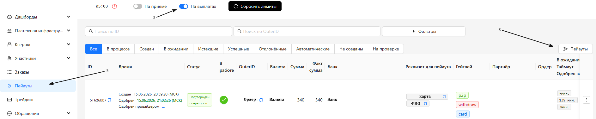

<h1 style="color: black; font-size: 2.2em; font-weight: bold; margin-bottom: 30px;">8. Payouts</h1>

Great! You have moved to the "Payouts" section. Here we will learn what payouts are, what they are needed for, and how to perform them correctly.

<h3 style="color: black; font-size: 1.5em; margin-top: 30px;">What are Payouts</h3>

<strong>A Payout</strong> is a payment of funds to the client. It can be made in one or several transfers. For each transaction, you are required to upload a receipt to the request — this is confirmation of the completed payout.

<h3 style="color: black; font-size: 1.5em; margin-top: 25px;">Why Payouts are Needed</h3>

<ul style="color: black; font-size: 1.15em; padding-left: 20px;">
  <li><strong>Payment to the Client</strong> — the main purpose of payouts. You transfer money to the recipient according to the request.</li>
  <li><strong>Working Deposit Top-up</strong> — each confirmed payout is returned to your deposit, supporting working capital.</li>
  <li><strong>Savings on Exchange</strong> — with a payout, you only spend the transfer commission. This is more profitable than exchanging through crypto exchanges, where you lose on the spread and additionally pay a withdrawal fee from the exchange.</li>
</ul>

<h3 style="color: black; font-size: 1.5em; margin-top: 30px;">How to Make Payouts Correctly</h3>

<h3 style="color: black; font-size: 1.5em; margin-top: 30px;">Step-by-Step Guide</h3>

<strong>1. Step:</strong> Your card balance has been replenished — now you need to make a payout to reimburse the deposit balance and free up the card for new receipts. Go to your personal account, turn on the <strong>"Payouts"</strong> toggle. Then go to the <strong>"Payouts"</strong> section, in the right corner find the <strong>"PAYOUTS"</strong> button and click on it — the system will redirect us to the payouts page.

  
  
Step 1: Go to Payouts

<strong>2. Step:</strong> We have moved to the payouts page. Here we see requests that we have already completed, or an empty window — if there were no payouts yet. Our next steps are simple: <strong>wait for a new request</strong> for payout. As soon as it appears — we start processing.

  
  
Step 2: Waiting for a Request

<strong>3. Step:</strong> A request has arrived! When it appears, you receive a notification <strong>"New Withdrawal Order"</strong>. The request itself is displayed with the status <strong>"In Progress"</strong>.

<strong>4. Step:</strong> Expand the request and see all the necessary information:

<ul style="color: black; font-size: 1.15em; padding-left: 20px;">
  <li>Time to complete</li>
  <li>Recipient's bank</li>
  <li>Card number / phone number / account number / IBAN</li>
  <li>Recipient's first and last name</li>
  <li>Amount to be paid</li>
  <li>"Attach Receipt" button</li>
  <li>Action buttons: <strong>Approve</strong>, <strong>Decline</strong>, <strong>Transfer Order to Another Team</strong></li>
</ul>

<strong>5. Step:</strong> Look at the completion time.If the request has <strong>0 minutes</strong> or <strong>3-4 minutes</strong> left — we <strong>do not execute</strong> such a request, but transfer it to another team. This is important: with 0 minutes, the request may not be credited to your deposit, and with 3-4 minutes remaining, you may simply not have time to complete the transfer. Such errors impose a minus on the team in the amount of the payout you made.

  
<strong>⚠️ Important Rule:</strong> Watch the request timer. If there is not enough time — transfer the request to another team to avoid financial losses.

<strong>6. Step:</strong> We have made sure there is enough time. Copy the recipient's details and go to your bank to make the transfer.

<strong>7. Step:</strong> In the bank, click "Transfer", enter the amount — strictly the same as specified in the request. Insert the recipient's details, fill in all the fields requested by the bank, and click "Transfer".

<strong>8. Step:</strong> After the transfer, open the receipt and check the status. <strong>The status must be "Successful" or "Completed".</strong>

<strong>9. Step:</strong> The receipt is successful — take a screenshot or save the receipt file. Go back to the request, click "Attach Receipt", upload the file. After uploading, click <strong>"Completed"</strong>. The request moves to the status <strong>"Confirmed by Operator"</strong>.

<strong>10. Step:</strong> If the transfer could not be completed due to the recipient (for example, incorrect details) — click the <strong>"Decline"</strong> button.

<strong>11. Step:</strong> If you cannot complete the request for technical reasons (no balance on the card, insufficient time, accidentally activated payouts) — click <strong>"Transfer Order to Another Team"</strong>.

  
  
Steps 3-11: Payout Processing

  

    Great! We have understood how to make payouts. Let's highlight the main rules to solidify the section.
  

<h3 style="color: black; font-size: 1.5em; margin-top: 30px;">📋 Main Rules</h3>

  
<strong>1. Rule:</strong> Always pay attention to the <strong>completion time</strong> of the request. If time is short or the timer shows <strong>0 minutes</strong> — <strong>do not execute</strong> such a request, transfer it to another team. If you violated this rule and the request was not credited to you — the team bears full responsibility.

  
<strong>2. Rule:</strong> After copying the details, <strong>always check them</strong> in the bank before sending. Teams often mistakenly pay out to details from a previous request. Such an error falls entirely on the team and is not refundable.

  
<strong>3. Rule:</strong> Make the transfer <strong>exactly for the amount</strong> specified in the request. If you transferred less — the client may demand a repeat payment in full. This error and minus falls on the team.

  
<strong>4. Rule:</strong> <strong>Always attach receipts</strong> to the request. Without a receipt, the payout is not considered confirmed.

<h3 style="color: black; font-size: 1.5em; margin-top: 30px;">📋 Payout Regulations</h3>

<ul style="color: black; font-size: 1.15em; padding-left: 20px;">
  <li>Time to complete one request — <strong>no more than 20 minutes</strong>.</li>
  <li>Payment in several transfers is made <strong>only after agreement</strong> with the administrator in TECH-chat.</li>
</ul>

  

    Great! We have finished the "Payouts" section. Follow the rules — and you will succeed! Move to the next section — click "Next".
  

  <a href="#/p2p" style="padding: 10px 20px; background-color: #e9ecef; border-radius: 6px; color: black; text-decoration: none; font-weight: bold;">← Back</a>
  <a href="#/appeals" style="padding: 10px 20px; background-color: #e9ecef; border-radius: 6px; color: black; text-decoration: none; font-weight: bold;">Next →</a>

