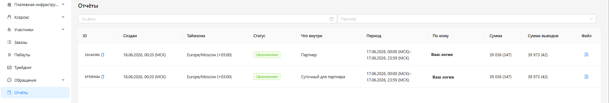

<h1 style="color: black; font-size: 2.2em; font-weight: bold; margin-bottom: 30px;">10. Reports</h1>

Great! You have started studying the "Reports" section. Study this section so that your calculations are always correct.

<h3 style="color: black; font-size: 1.5em; margin-top: 30px;">What are Reports</h3>

<strong>A Report</strong> is a financial statement compiled by the system about the work done over a certain period of time.

<h3 style="color: black; font-size: 1.5em; margin-top: 30px;">What Types of Reports Exist</h3>

<strong>1. Daily Report</strong> — it is compiled by the system from 00:00 MSK to 23:59 MSK. This report counts exclusively a 24-hour period, regardless of when you started the shift and when you finished it.

<strong>2. Partner Report</strong> — it is compiled by the system from the beginning of the work shift to its completion.

  
  
"Reports" Section

  

    Great! You have finished the "Reports" section. Click "Next".
  

  <a href="#/appeals" style="padding: 10px 20px; background-color: #e9ecef; border-radius: 6px; color: black; text-decoration: none; font-weight: bold;">← Back</a>
  <a href="#/chats" style="padding: 10px 20px; background-color: #e9ecef; border-radius: 6px; color: black; text-decoration: none; font-weight: bold;">Next →</a>

