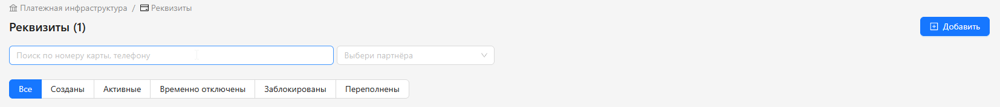

<h1 style="color: black; font-size: 2.2em; font-weight: bold; margin-bottom: 30px;">4.1 Requisites</h1>

Great! You have moved to the "Requisites" section. Let's start learning.

  

<h3 style="color: black; font-size: 1.5em; margin-top: 30px;">Step-by-Step Guide</h3>

<strong>1. Step:</strong> Requisite search bar. This bar is designed to find the necessary requisite.

<strong>2. Step:</strong> When searching, select a partner — yourself.

<strong>3. Step:</strong> We see buttons that are responsible for filtering requisites:

<ul style="color: black; font-size: 1.15em; padding-left: 20px;">
  <li><strong>All</strong> — clicking this button, all requisites will be displayed.</li>
  <li><strong>Created</strong> — clicking this button, requisites that you added but have not yet activated will be shown.</li>
  <li><strong>Active</strong> — clicking this button, you will see all requisites that are activated and in "Active" status.</li>
  <li><strong>Temporarily Disabled</strong> — clicking this button, you will see requisites on pause that are in "Inactive" status.</li>
  <li><strong>Blocked</strong> — clicking this button, you will see requisites that are:
    <ul style="padding-left: 20px; margin-top: 5px;">
      <li>blocked by you;</li>
      <li>blocked by the system due to poor conversion;</li>
      <li>blocked by administrators due to incorrect operation.</li>
    </ul>
  </li>
  <li><strong>Overfilled</strong> — clicking this button, you will see requisites that have filled the balance you specified in the limits.</li>
</ul>

<strong>4. Step:</strong> "Add Requisite" button.

  

    Great! You now understand the filters and requisites statuses. To continue, click "Add Requisite" in the left menu and learn how to create a new requisite.
  

  <a href="#/requisites" style="padding: 10px 20px; background-color: #e9ecef; border-radius: 6px; color: black; text-decoration: none; font-weight: bold;">← Back</a>
  <a href="#/add-requisite" style="padding: 10px 20px; background-color: #e9ecef; border-radius: 6px; color: black; text-decoration: none; font-weight: bold;">Next →</a>

