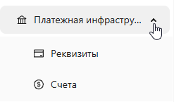

<h1 style="color: black; font-size: 2.2em; font-weight: bold; margin-bottom: 30px;">4. Payment Infrastructure — Requisites and Accounts</h1>

Great! We are starting to explore the "Payment Infrastructure" tab. This is a very important and long section, so the training will be divided into subsections "Requisites" and "Accounts". Read carefully!

  

    <h3 style="color: black; font-size: 1.5em;">Section Contents</h3>
    
<strong>📋 Requisites</strong>

    
In this section you will learn:

    <ul style="color: black; font-size: 1.15em; padding-left: 20px;">
      <li>how to add a requisite</li>
      <li>how to activate a requisite</li>
      <li>how to deactivate a requisite</li>
      <li>how to block a requisite</li>
    </ul>
    
<strong>📊 Accounts</strong> — here you will learn how to work with accounts and track fund movements.

  

  

    
    
Payment Infrastructure

  

  

    Having mastered "Requisites" and "Accounts", you will be able to fully manage your payment infrastructure. Don't stop there — start with "Requisites" or "Accounts"!
  

  <a href="#/conversion" style="padding: 10px 20px; background-color: #e9ecef; border-radius: 6px; color: black; text-decoration: none; font-weight: bold;">← Back</a>
  <a href="#/requisites-info" style="padding: 10px 20px; background-color: #e9ecef; border-radius: 6px; color: black; text-decoration: none; font-weight: bold;">Next →</a>

