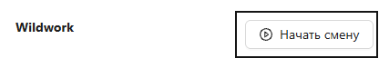
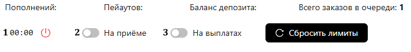
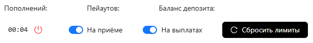

<h1 style="color: black; font-size: 2.2em; font-weight: bold; margin-bottom: 30px;">2. How to Start a Work Shift and Put It on Pause</h1>

  

    
Great! We have set up security, now we need to start the shift.

    <h3 style="color: black; font-size: 1.5em;">Step-by-Step Guide</h3>
    
<strong>1. Step:</strong> To start an active shift, we need to click the "Start Shift" button. After clicking this button, click "Start", after which action buttons and information about your shift appear.

  

  

    
    
Step 1: Start Shift

  

  

    
<strong>2. Step: Shift Information</strong>

    <ul style="color: black; font-size: 1.15em; padding-left: 20px; margin-top: 5px;">
      <li><strong>Top-up</strong> — the amount of successful requests credited.</li>
      <li><strong>Payouts</strong> — how many payouts you have confirmed.</li>
      <li><strong>Deposit Balance</strong> — shows your current working deposit.</li>
      <li><strong>Total Orders in Queue</strong> — how many payouts are awaiting execution.</li>
    </ul>
  

  

    
    
Step 2: Information and Buttons

  

  

    
<strong>3. Step: Action Buttons</strong>

    <ol style="color: black; font-size: 1.15em; padding-left: 20px; margin-top: 5px;">
      <li><strong>1. Button</strong> — responsible for closing the shift and starting the next one.</li>
      <li><strong>"Receiving"</strong> — responsible for pausing and enabling traffic flow to your personal account. If turned off — top-up requests do not come. If turned on — top-up requests come to you.</li>
      <li><strong>"Payouts"</strong> — responsible for pausing and enabling traffic to your account. If turned off — payouts do not come to you. If turned on — payouts come to you.</li>
    </ol>
  

  

    
    
Step 3: Action Buttons

  

  

    Great! Now you know how to start a shift, pause it, and track indicators. This will definitely come in handy at work!
  

  <a href="#/wildworktech" style="padding: 10px 20px; background-color: #e9ecef; border-radius: 6px; color: black; text-decoration: none; font-weight: bold;">← Back</a>
  <a href="#/conversion" style="padding: 10px 20px; background-color: #e9ecef; border-radius: 6px; color: black; text-decoration: none; font-weight: bold;">Next →</a>

