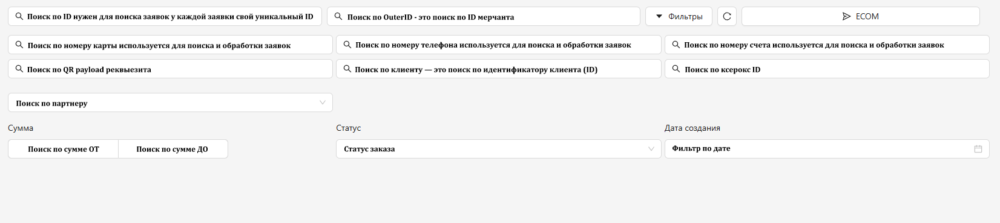
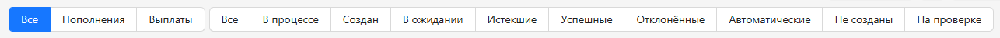

<h1 style="color: black; font-size: 2.2em; font-weight: bold; margin-bottom: 30px;">Фильтры</h1>

Фильтр в разделе «Заказы» вам необходим для поиска заявок, разделения заявок по реквизитам, а также для сортировки заказов по сумме и дате. Освоив этот инструмент, вы сможете быстро находить нужную информацию и работать с заказами гораздо эффективнее. Ознакомьтесь с пошаговой инструкцией ниже.

  
  
Раздел «Фильтры»

<h3 style="color: black; font-size: 1.5em; margin-top: 30px;">Пошаговая инструкция</h3>

<strong>1. Поиск по ID</strong> — строка для поиска заявок по их уникальному идентификатору (ID). Пример ID: <strong>9dfa78c5-c632-4136-8b5b-6b2f0a6866b0</strong>. Этот поиск пригодится для подтверждения заявок и закрытия кейсов из чата <strong>«CHECK»</strong>.

<strong>2. Поиск по OuterID</strong> — строка для поиска заявки по идентификатору мерчанта (OuterID).

<strong>3. Поиск по номеру карты, номеру телефона, номеру счёта</strong> — эти поля позволяют фильтровать заявки по вашим реквизитам, собирать по ним статистику и при необходимости разделять вкладки по разным реквизитам.

<strong>4. Поиск по QR payload</strong> — строка для поиска реквизита по ссылке на QR-код. Удобно, если вы работаете с оплатами через QR.

<strong>5. Поиск по клиенту</strong> — поиск заявок по ID клиента. Помогает быстро найти все операции конкретного пользователя.

<strong>6. Поиск по Ксерокс ID</strong> — строка для поиска заявок по идентификатору в системе Ксерокс.

<strong>7. Поиск по партнёру</strong> — если в вашем кабинете работает несколько партнёров, этот фильтр позволяет разделить заявки и смотреть статистику по каждому из них отдельно.

<strong>8. Поиск по сумме</strong> — позволяет отфильтровать заявки по сумме. Вы можете задать диапазон: сумму <strong>«ОТ»</strong> и сумму <strong>«ДО»</strong> — и увидеть только те заказы, которые попадают в этот промежуток.

<strong>9. Статус заказа</strong> — даёт возможность отобразить заказы с определённым статусом, например только успешные или только отклонённые.

<strong>10. Дата создания</strong> — классический фильтр по периоду: выберите начальную и конечную дату — и увидите все заказы за этот промежуток времени.

<h3 style="color: black; font-size: 1.5em; margin-top: 30px;">Кнопки быстрой фильтрации:</h3>

Помимо ручных настроек, в разделе есть кнопки, которые мгновенно отбирают заказы по ключевым статусам:

<ul style="color: black; font-size: 1.15em; padding-left: 20px;">
  <li><strong>ВСЕ</strong> — полный список всех поступавших на вас заявок.</li>
  <li><strong>В ПРОЦЕССЕ</strong> — заказы, которые уже созданы и ожидают оплаты или подтверждения.</li>
  <li><strong>УСПЕШНЫЕ</strong> — подтверждённые заявки (автоматически или вручную).</li>
  <li><strong>ОТКЛОНЁННЫЕ</strong> — заявки, которые были отменены по истечении времени либо вручную вами или администратором.</li>
</ul>

  
  
Кнопки фильтрации заказов

  

    Отлично! Мы поняли, как пользоваться фильтрами. Давай перейдём к самой работе по методам — нажимай «Вперёд», чтобы продолжить.
  

  <a href="#/orders" style="padding: 10px 20px; background-color: #e9ecef; border-radius: 6px; color: black; text-decoration: none; font-weight: bold;">← Назад</a>
  <a href="#/ecom" style="padding: 10px 20px; background-color: #e9ecef; border-radius: 6px; color: black; text-decoration: none; font-weight: bold;">Вперёд →</a>

