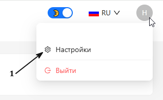
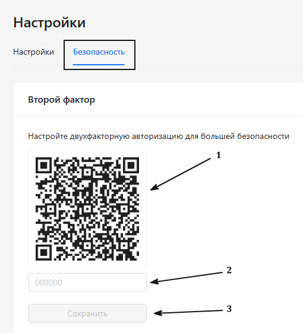

<h1 style="color: black; font-size: 2.2em; font-weight: bold; margin-bottom: 30px;">1. Настройка безопасности личного кабинета</h1>

  

    
Первое, с чего мы начнём обучение, — это настройка безопасности вашего личного кабинета. На скриншотах цифрами указано, как это сделать.

    <h3 style="color: black; font-size: 1.5em;">Пошаговая инструкция</h3>
    
<strong>1. Пункт:</strong> В правом верхнем углу находим иконку вашего личного кабинета, наводим на неё мышкой — открывается меню с вашим логином и настройками. Нажимаем на «Настройки».

  

  

    
    
Шаг 1: Переход в настройки

  

  

    
<strong>2. Пункт:</strong> После того как вы перешли в настройки, открываем раздел «Безопасность», нажимаем кнопку «Настроить» и настраиваем себе 2FA:

    

      <strong>①</strong> Сканируем QR-код, сохраняем в приложение Google Authenticator.
    

    

      <strong>②</strong> После вводим 6-значный код.
    

    

      <strong>③</strong> Нажимаем кнопку «Сохранить».
    

  

  

    
    
Шаг 2: Настройка 2FA

  

  

    Поздравляем! Вы только что сделали свой личный кабинет безопаснее. Отличная работа!
  

  <a href="#/" style="padding: 10px 20px; background-color: #e9ecef; border-radius: 6px; color: black; text-decoration: none; font-weight: bold;">← Назад</a>
  <a href="#/shift-start" style="padding: 10px 20px; background-color: #e9ecef; border-radius: 6px; color: black; text-decoration: none; font-weight: bold;">Вперёд →</a>

